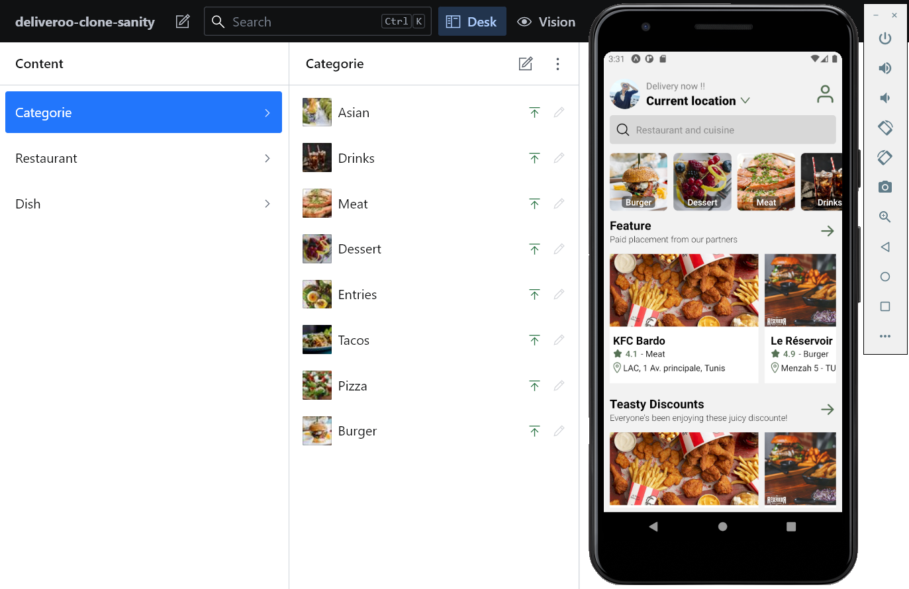
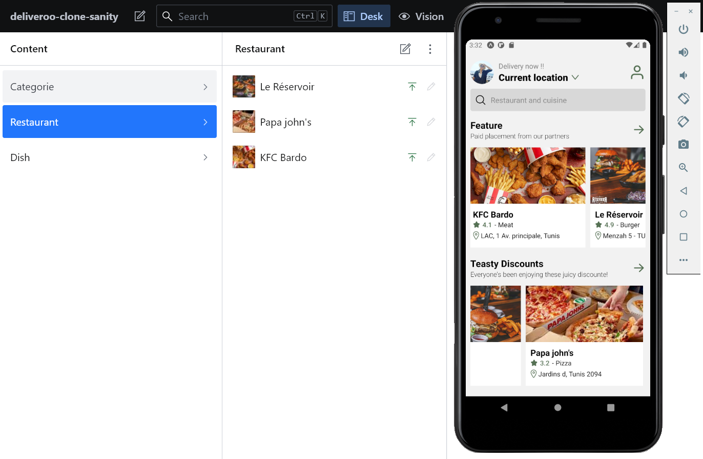
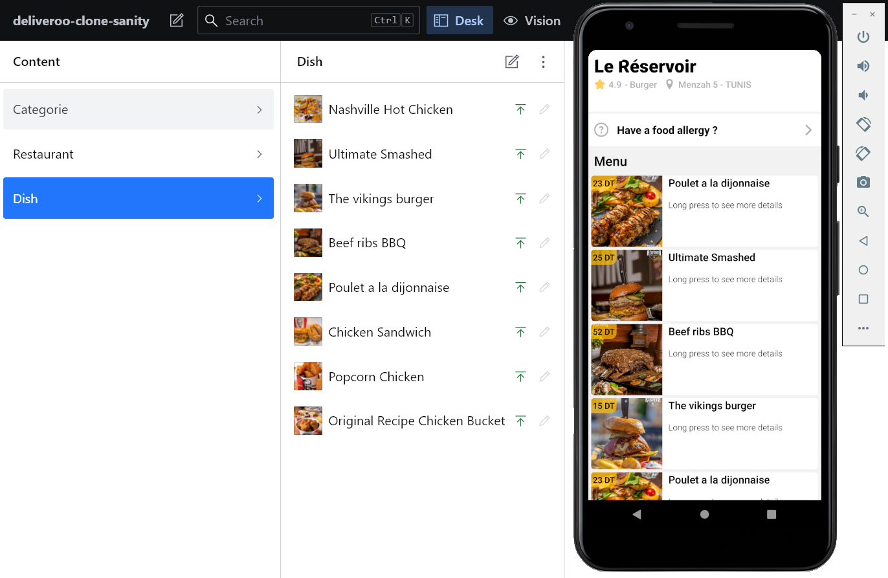
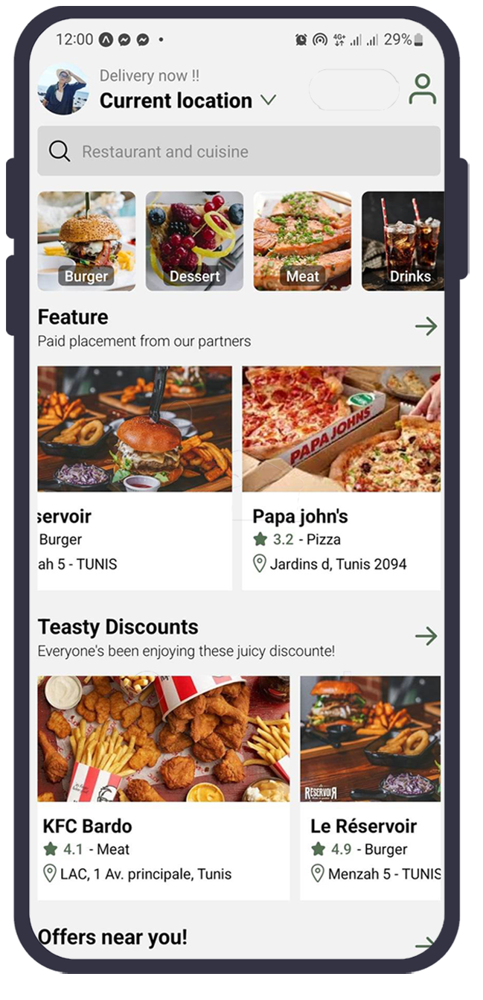
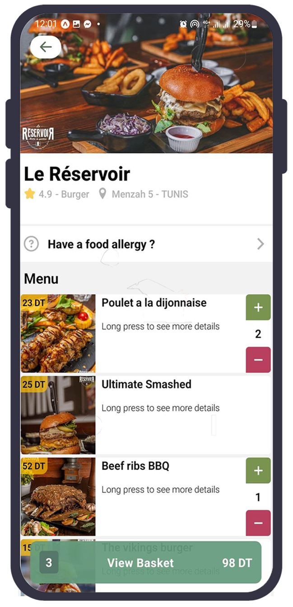
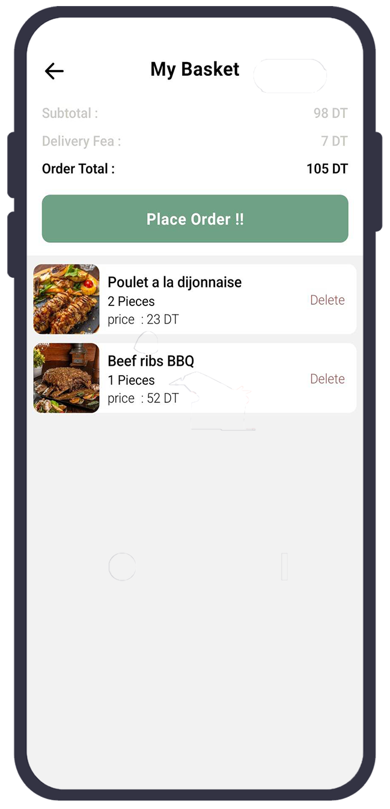
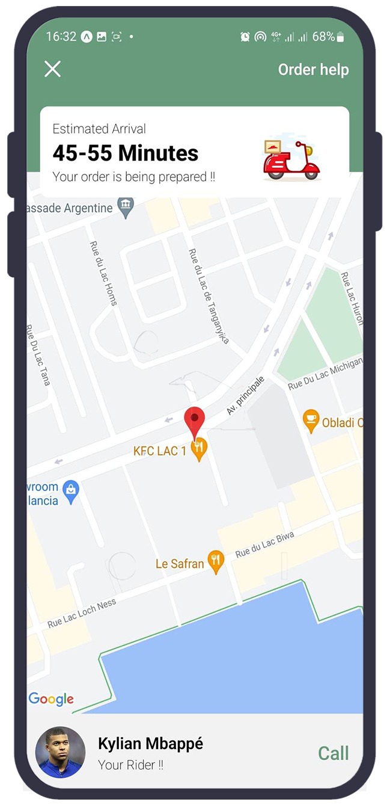

 
  <div >
  
  </div>
   
 <br>

## 📲 About
Deliveroo is a British food delivery company founded by Will Shu and Greg Orlowski. It operates in several countries: United Kingdom, France, Belgium, Ireland, Italy, United Arab Emirates, Australia, Singapore and Hong Kong

🛠 So in this project (it' my first project with React Native by the way 😋) i have tried to recreate a clone for some screens of Deliveroo APP
using React Native, and Sanity.io for the Back-end part

 <br>
 
 ## 👀 Preview
 [](https://expo.dev/@torjmen/deliveroo-clone)


### :1234: Instructions to Preview (Android)

1. Head over to the Google Play Store and download the Expo Go app

   - Link: https://play.google.com/store/apps/details?id=host.exp.exponent

2. Open the [Expo Go](https://play.google.com/store/apps/details?id=host.exp.exponent 'Expo Go') app or simply go to the [Expo website](https://expo.io/ 'Expo') and follow the instructions to register for an Expo account

   - Note: _**You will need an account on Expo in order to view the app!**_

3. After completing step 1 and 2 above, open your device camera and scan the provided QR code in the link below:

   - Link: https://expo.dev/@torjmen/deliveroo-clone (_**Published version of app hosted on Expo**_)

4. After scanning the QR code, the Expo Go app will automatically load up the app

   - Note: _**If this is your first time opening the app, it might take a while to load up. Please be patient!**_

5. Enjoy 😀

### :bangbang: IMPORTANT! - _Note for iOS users_

Unfortunately, iOS users will not be able to preview the published app hosted on Expo. This issue is due to restrictions imposed by Apple and not by Expo itself.

For this, please refer to the app screenshots below. A mixture of both screenshot pictures and GIFs is provided as an alternative for previewing the app.

<br>

## ⚙️ Core Tech Stack

- :arrow_up_small:&nbsp; [Expo](https://expo.io/ 'Expo')
- :electron:&nbsp;[React Native](https://reactnative.dev/ 'React Native')
- ⚛️ [React Redux](https://styled-components.com/ 'React Redux')
- :link:&nbsp; [React Navigation](https://reactnavigation.org/ 'React Navigation')
- 🗺️ [React Native Maps](https://github.com/react-native-maps/react-native-maps 'React Native Maps')
- :performing_arts:&nbsp; [Styled Components](https://styled-components.com/ 'Styled Components')


## 📖 Demo
- Sanity.io CMS is the platform for structured content. With Sanity.io you can manage your text, images, and other media with APIs. You can also use the open-source single page application Sanity Studio to quickly set up an editing environment that you can customize 

## Sanity Dashboard
<p>
    
    
    
</p>

## My App ScreenShotes
<p>
    
    
    
</p>
<p>
    
    
</p>

## :gear: Installation
 


### Run Locally my project with Expo CLI

install Expo 

```bash
npm install --global expo-cli
```

Clone the project

```bash
  git clone https://github.com/MoAmineTorjmen/deliveroo-clone.git
```

change directory

```bash
  cd Deliveroo-Clone
```

Install dependencies

```bash
  npx expo install
```

Start the server

```bash
  npx expo start
```

### Run Locally the Sainty server

install Sanity 

```bash
npm install -g @sanity/cli 
```
change directory

```bash
cd sanity
```

launch the Sainty server

```bash
Sanity start
```

 
 ## 🤝 Contact
 My linkedin : https://www.linkedin.com/in/torjmen-med-amine-562770176/ 
 
 My Facebook : https://www.facebook.com/TorjmenMedAmine/
